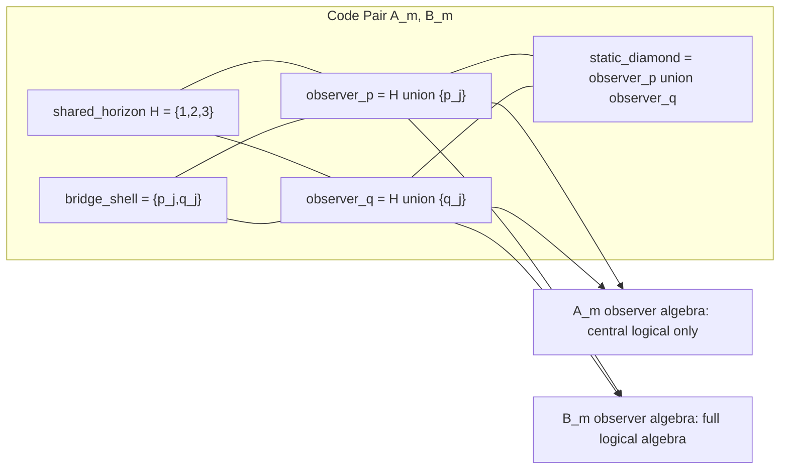

# Two-Page Memo: Finite Causal-Patch Toy Cosmologies

## One-Sentence Result

We built exact finite stabilizer-code toy cosmologies where entropy-visible
data can agree while observer-patch reconstructability, erasure semantics, and
channel behavior differ. The strongest lesson is not “ER=EPR is false,” but
that entanglement summaries alone are too weak: geometry-like claims need
operator-algebra and channel-semantic checks.

## Bridge Causal Patch Diagram

The diagram is deliberately combinatorial. `H`, `observer_p`, and
`observer_q` are named qubit regions, not embedded spacetime regions. Their
“geometry” is whatever survives exact entropy, algebra, erasure, and channel
diagnostics.

## Phase / Claim Table

| Phase or Package | Claim | Status |
| --- | --- | --- |
| Goal 1 bridge theorem | CSS pairs `A_m,B_m` have `n=6+2m`, `k=1`, `d=2`, matching labeled one- and two-qubit entropy, no single-qubit non-central logical reconstruction, and distinct reconstruction/algebra profiles. | Exact theorem plus finite-prefix checks |
| Phase 1 static atlas | Named patch entropy, overlap, MI, CMI, and I3 match; shared-horizon algebra matches; observer-patch reconstructability differs. | Exact finite certificate |
| Phase 2 bridge growth | Deterministic bridge growth preserves the separation and gives exact increment laws for observer entropy, MI, CMI, I3, and witness algebra signatures. | Exact finite certificate |
| Phases 3-8 source/cover search | Generic covers find the seed but not lifted bridge slices; source-aware bridge atlases recover lifted sources. | Exact bounded-search evidence |
| Phases 11-13 repaired non-CSS | Distance repair, low-order entropy matching, and strict causal-patch erasure semantics are separable; atlas-aware covers recover strict repaired hits. | Exact finite and bounded-search evidence |
| Phases 21-28 channels | Exact transition graphs and rational channel rules show stationary weights, absorbing classes, target signs, and Pareto frontiers depend on rules and substrates; selected horizon fixed points stay stable. | Exact finite certificates and exhaustive bounded searches |
| Phases 29-30 co-design | Some robust no-go signs are substrate- or cover-sensitive; near-miss entropy flips can fail the erasure gate. | Exact bounded-search evidence |
| Phase 31 strict-cover audit | Among 175 repaired covers: 66 raw hits, 8 strict hits, 58 erasure-gate rejections. `entropy_break - full_semantics` stays negative for all strict hits; operator flips occur exactly when `observer_p_private_blocks` is nonempty. | Exact exhaustive bounded search |

## What This Teaches ER=EPR / QEC Cosmology

The toy models support a precise version of a common suspicion: entanglement
data can look geometric while reconstruction data disagree. In the
balanced-bridge family, low-order entropy diagnostics match, named patch
entropy/overlap data match, and the shared horizon algebra matches, yet the
observer patches differ in whether they reconstruct the full logical algebra.
That is a small, checkable ER=EPR pressure test: “same entanglement-looking
data” does not force “same observer-accessible geometry.”

The source-aware cover results also matter. Generic subset covers are not
enough to recover the lifted bridge family, while the bridge-aware atlas does.
This says the cover is part of the toy cosmology data. A causal patch is not
just any subset with nice entropy numbers; it needs a semantics certified by
reconstruction, erasure, and complementarity diagnostics.

The channel phases add a second caution. Once the static toy universe is turned
into a finite transition graph, stationary bucket weights and target signs
depend on the channel rule and substrate. Some horizon fixed-point semantics
remain stable, but the distribution over “full semantics,” “entropy break,” and
“operator collapse” can change. This is a useful finite analogue of the idea
that emergent geometry is not just a state invariant; it also depends on the
allowed dynamics and reconstruction map.

The Phase 31 audit is the sharpest bounded result. Inside one repaired-cover
family, the entropy objective stays a no-go under the strict causal-patch gate,
but operator-related signs flip exactly when observer P gains a private outer
block. That separates a persistent entropy obstruction from a cover-sensitive
operator effect.

## Why This Is Not Overclaimed

These are small finite stabilizer/CSS/non-CSS toy models, mostly with `k=1`.
The bridge theorem is all-`m` for one specific generator family, not a theorem
about all stabilizer codes. The strict-cover audit is exhaustive only for the
175-cover Phase 12 repaired family, not for all possible covers. The channel
claims are exhaustive only for the stated finite transition graphs, substrates,
and rule languages.

The de Sitter, ER=EPR, and cosmology language is diagnostic. There is no claim
that these qubit regions are literal spacetime regions, or that the bridge
shell is a physical wormhole. The claim is more modest and more useful:
finite QEC systems can exhibit controlled divergences between entropy-visible
structure, reconstruction-visible structure, and channel-visible structure.

The work also keeps near-misses separate from strict hits. For example, Phase
30 found a cover where an entropy no-go flips, but that cover fails the
erasure-correctability profile and is rejected by the strict gate. This is the
right behavior for a search-and-conjecture engine: generate tempting examples,
then let exact certificates decide what survives.

## Reproducibility Pointers

- The theorem seed: `python3 -m qgtoy bridge-proof-check`
- Static atlas: `python3 -m qgtoy cosmology-phase1 --max-m 3`
- Growth dynamics: `python3 -m qgtoy cosmology-phase2 --max-m 3`
- Repaired strict atlas: `python3 -m qgtoy cosmology-phase12`
- Channel synthesis: `python3 -m qgtoy cosmology-phase27`
- Strict-cover audit: `python3 -m qgtoy cosmology-phase31`

