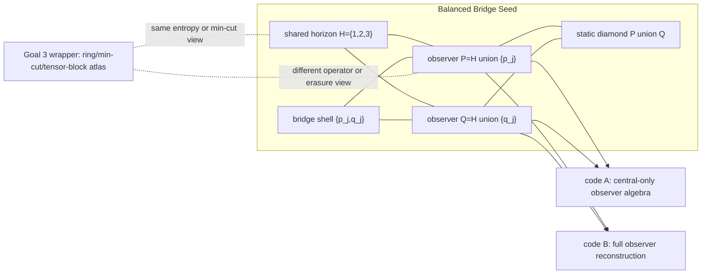

# Two-Page Human Memo: Bridge Causal Patches To Perfect Outer Blocks

## One-Sentence Result

The finite bridge toy models now have a holographic-code cousin: exact
stabilizer certificates show that entropy-visible and min-cut-visible data can
match while observer reconstruction, erasure semantics, and compact
causal-patch locality split. The strongest Goal 3 version uses a literal
`[[5,1,3]]` five-qubit perfect outer block, giving an `n=25,k=1` pair with
matching labeled size-two entropies, both distances at least three, and a
compact observer-algebra witness.

## Bridge Causal-Patch Diagram

This diagram is combinatorial, not geometric in the continuum sense. The
regions are named qubit subsets. The point is to ask whether the same named
regions can agree on entropy and graph diagnostics while disagreeing on the
operator algebra an observer can actually reconstruct.

## Phase / Claim Table

| Phase | Human Claim | Certificate Type |
| --- | --- | --- |
| Goal 1 bridge theorem | The CSS family `A_m,B_m` has `n=6+2m,k=1,d=2`, matching labeled one- and two-qubit entropy diagnostics, no single-qubit non-central logical reconstruction, and distinct observer algebra profiles. | Exact theorem package plus finite-prefix checks |
| Goal 2 static/dynamic causal patch | Named patch entropies, overlaps, MI/CMI/I3, and shared-horizon algebra match while observer-patch reconstructability differs; deterministic bridge growth preserves the separation with exact increment laws. | Exact finite certificates |
| Goal 2 cover/channel audits | Generic covers find the seed but not lifted bridge slices; source-aware covers recover them. Channel substrates and rational rules change stationary weights and target signs while selected horizon fixed points remain stable. | Exact bounded searches and finite channel certificates |
| Goal 2 Phase 31 strict-cover audit | In the 175-cover repaired family, there are 66 raw hits, 8 strict hits, and 58 erasure-gate rejections. `entropy_break - full_semantics` stays negative for all strict covers. | Exact exhaustive bounded search |
| Goal 3 Phase 1 | The bridge pair can be wrapped in an eight-boundary ring-spoke skeleton with matching min-cut and low-order entropy data while observer reconstruction still splits. | Exact finite tensor-network seed |
| Goal 3 Phases 2-4 | A graph/CWS source gives a frontier ring witness; distance repair lifts it to `n=20,k=1,d>=2`; multi-bulk layouts keep the operator/erasure witness but show compact locality is source-aware. | Exact bounded search and finite certificates |
| Goal 3 Phases 5-6 | Generated boundary layouts fail to recover strict compact locality in the tested grammar; generated Clifford layers can preserve or collapse reconstruction semantics without changing the selected entropy/min-cut data. | Exact generated-layout and Clifford audits |
| Goal 3 Phase 7 | Joint search over six Clifford circuits and compact intervals finds replacement-patch witnesses: 720 intervals, 23 hits, 11 distance-preserving hits. | Exact bounded compact-patch search |
| Goal 3 Phase 8 | Distance-gated synthesis over 38 adjacent-pair `CX` layers finds 95 distance-preserving compact hits, with shortest robust hits at length four. | Exact bounded synthesis search |
| Goal 3 Phase 9 | Two-layer Clifford block dynamics on a compressed five-pentagon skeleton finds 112 distance-preserving compact hits, with shortest robust hits at length two. | Exact code dynamics plus exact compressed min-cut audit |
| Goal 3 Phase 10 | A literal `[[5,1,3]]` perfect outer block gives an `n=25,k=1` pair with 326 labeled size-two entropy matches, distances `3` and `4`, 29 compact operator/channel hits, and a strict lifted three-block witness. | Exact finite certificate |

## What This Teaches ER=EPR / QEC Cosmology

The useful lesson is not that ER=EPR is wrong. It is that finite QEC systems
let us separate several ideas that are often blurred together in slogans. In
these examples, the same entropy-looking data can coexist with different
observer-accessible operator geometry. That is a concrete pressure test for
any claim that entanglement summaries alone determine connectivity.

The bridge construction is the clean seed. The observer patches share a horizon
and agree on named entropy/overlap diagnostics, yet one code gives only a
central logical algebra on the observer patch while the other reconstructs the
full logical algebra. The causal-patch atlas therefore has two faces: an
entropy-visible face that matches, and an operator-visible face that splits.

Goal 3 asks whether this survives when the toy universe is made more
holographic-looking. It does. Ring-spoke graphs, generated boundary orders,
Clifford tensor layers, compressed pentagon blocks, and finally a literal
five-qubit perfect outer block all preserve versions of the same basic
phenomenon. Compact locality is not automatic: it depends on the atlas, the
tensor layer, and the source semantics. But when the witness survives, it is
certified by exact stabilizer algebra, exact erasure checks, and exact min-cut
enumeration.

The QEC-cosmology lesson is especially sharp in Phase 10. The perfect outer
block makes distance and erasure semantics explicit. Both concatenated codes
have distance at least three, and the outer block has the expected
two-erasure-correction / three-region-reconstruction behavior. Even there,
labeled low-order entropy matching does not force matching observer algebra:
the selected compact interval `(4,9,14)` has entropy `3` in both codes and
min-cut `5`, but algebra `(2,0,0,true)` versus `(0,0,2,false)` and erasure
`false` versus `true`.

So the project gives a practical AI-search target. Let neural or heuristic
systems propose states, circuits, atlases, and channel rules. Then accept only
claims that reduce to exact stabilizer computation, finite graph enumeration,
rational channel arithmetic, or exhaustive bounded search. The result is a
small toy universe where conjectures are cheap to generate and hard to fake.

## Why This Is Not Overclaimed

Nothing here solves quantum gravity, proves a physical wormhole, or supplies a
continuum holographic dual. The regions are finite qubit subsets with role
labels. Those labels are useful because they define reproducible diagnostics;
they are not physical geometry by themselves.

The exact results also have bounded scope. Goal 1 is theorem-level for one CSS
generator family. Goal 2 Phase 31 is exhaustive for one 175-cover repaired
family, not for all covers. Goal 3 searches are exhaustive only inside their
declared grammars: selected graph/CWS sources, generated boundary orders,
Clifford layer menus, compact interval windows, and finite min-cut skeletons.

Phase 10 is stronger than the earlier distance-one and weight-one-screened
frontier evidence, but it is still not a same-distance theorem. The
concatenated pair has exact distances `3` and `4`. That asymmetry is reported
as part of the result because it matters: the phase is a robust perfect-block
pressure test, not a proof that all distance-matched holographic codes can do
this.

The min-cut diagnostics are also kept honest. They are exact graph quantities
computed on declared finite skeletons, not asserted as a global RT theorem.
They help compare entropy-visible, reconstruction-visible, and
channel-visible notions of emergent geometry. The scientific claim is modest
and useful: in small exact QEC universes, those notions can line up in some
places and come apart in others.

The next serious step is therefore targeted rather than grandiose: search for
same-distance perfect-outer variants, or build a small multi-tensor
HaPPY-like stabilizer network where boundary entropy, min-cut, reconstruction,
erasure, survivor fixed points, and distance can all still be checked exactly.
