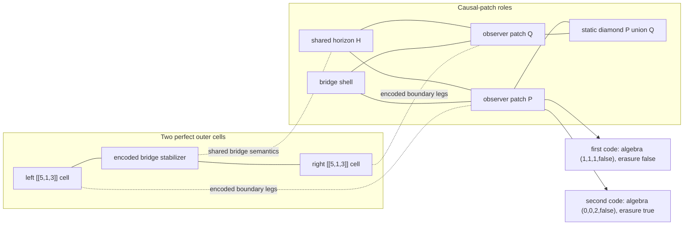

# Two-Page Human Memo: Bridge Causal Patches To Two Perfect Tensors

## One-Sentence Result

The bridge causal-patch toy model now survives a more holographic-looking
upgrade: a two-`[[5,1,3]]` perfect-tensor outer tiling gives an exact
`n=50,k=1` stabilizer-code pair with matching low-order entropy data and
matching compact min-cut data, while the selected observer patch still has
different operator algebra, erasure behavior, and survivor fixed-point
semantics.

## Bridge Causal Patch Diagram

The picture is combinatorial. The regions are named qubit subsets and atlas
roles, not literal continuum spacetime regions. The point is that the same
named patch can agree on entropy-visible and min-cut-visible diagnostics while
disagreeing on what an observer can reconstruct.

## Phase / Claim Table

| Phase | Main claim | Certificate status |
| --- | --- | --- |
| Goal 1 bridge theorem | The CSS family `A_m,B_m` has `n=6+2m,k=1,d=2`, matching labeled one- and two-qubit entropies, no single-qubit non-central logical reconstruction, and distinct observer algebra profiles. | Exact theorem package plus finite-prefix checks |
| Goal 2 causal-patch atlas | Named patch entropy, overlap, MI, CMI, I3, and shared-horizon algebra match while observer-patch reconstructability differs. | Exact finite certificates and bounded searches |
| Goal 2 strict-cover audit | In the repaired 175-cover family, there are 66 raw hits, 8 strict hits, and 58 erasure-gate rejections; `entropy_break - full_semantics` stays negative for all strict covers. | Exact exhaustive bounded search |
| Goal 3 Phases 1-4 | Ring-spoke and graph/CWS sources lift the bridge separation into tensor-network-style atlases, with compact locality depending on source-aware cover semantics. | Exact finite certificates and bounded searches |
| Goal 3 Phases 5-9 | Generated layouts, Clifford layers, and compressed pentagon blocks show compact witnesses can persist, collapse, or reappear depending on the circuit and atlas grammar. | Exact bounded generated-layout and circuit audits |
| Goal 3 Phases 10-12 | A literal five-qubit perfect outer block preserves the split; Phase 12 shows same-distance repairs are not pure outer-qubit relabelings but local logical-axis effects. | Exact finite certificate plus exact bounded embedding search |
| Goal 3 Phase 13 | Two perfect outer cells joined by an encoded bridge give a same-distance `n=50,k=1` witness: entropy `3/3`, min-cut `5/5`, algebra `(1,1,1,false)` versus `(0,0,2,false)`, and erasure `false/true`. | Exact finite two-cell certificate plus bounded 48-spec repair audit |

## What This Teaches ER=EPR/QEC Cosmology

The useful lesson is not "ER=EPR is false." It is sharper and more testable:
entanglement-style summaries do not, by themselves, determine observer-visible
geometry. In the bridge family, low-order entropy diagnostics match. In the
causal-patch atlas, named patch entropies and overlaps match. In the Goal 3
tilings, compact min-cut diagnostics can also match. Yet the observer algebra,
erasure semantics, and survivor fixed point can still split.

That is a good toy-universe pressure test for ER=EPR-style reasoning. If two
finite systems have the same local entropy data and the same declared
min-cut-visible bridge, we still need to ask whether the same logical operators
are reconstructable in the same causal patch. The answer in Phase 13 is no:
for the selected `Y_q0_H` two-perfect-cell tiling, the compact interval
`(4,9,14)` has entropy `3` in both codes and exact min-cut value `5`, but the
first code has observer algebra `(1,1,1,false)` and is not erasure-correctable,
while the second has `(0,0,2,false)` and is erasure-correctable with a survivor
fixed point.

The QEC-cosmology lesson is also constructive. Geometry-like semantics are not
just subset semantics. Generic covers can miss lifted bridge structure, while
source-aware atlases recover it. Local Clifford and embedding choices can keep
low-order entropy fixed while changing distance, compact locality, and operator
access. Phase 13 makes this vivid: the three unrepaired bridge identities are
distance-asymmetric after concatenation, but 45 targeted local-axis repairs
give exact distance `3` versus `3` without erasing the reconstruction split.

This is exactly the kind of place where AI search is useful. Let a generator
suggest code pairs, tensor skeletons, boundary orders, or local Clifford edits.
Then keep only the candidates that survive exact stabilizer entropy, exact
region algebra, exact erasure checks, exact distance audits, and finite min-cut
enumeration. The machine proposes; the verifier decides. Nice little theorem
factory, with the smoke alarm wired in.

## Why This Is Not Overclaimed

Nothing here is a continuum quantum-gravity solution, a physical wormhole, or a
proof of a de Sitter dual. The regions are finite qubit subsets with role
labels. The labels are valuable because they define reproducible diagnostics,
but they are not physical geometry by themselves.

The exactness is local to declared finite families. Goal 1 is theorem-level for
one balanced-bridge CSS generator rule. Goal 2 Phase 31 is exhaustive for one
175-cover repaired family. Goal 3 Phase 13 is exact for one two-perfect-cell
stabilizer tiling construction and a bounded 48-spec repair menu. It is not an
exhaustive search over all local-Clifford embeddings, all tensor-network
topologies, all boundary atlases, or all holographic codes.

The min-cut statements are also intentionally modest. They are exact graph
quantities for the declared two-cell skeleton, not a global RT theorem. The
selected witness says that entropy/min-cut-visible structure and
operator/erasure-visible structure can come apart in a small certified QEC
universe. It does not say that entanglement never implies geometry, or that all
ER=EPR intuitions fail.

The strongest honest takeaway is therefore methodological: this project has a
reproducible loop for turning suggestive quantum-gravity slogans into finite
claims that can be checked. The next meaningful moves are not grander rhetoric;
they are larger exact families, such as three-perfect-cell chains or rings,
bridge-capacity variants, and eventually tensor-network or holographic-code
extensions with `d >= 3` analogues and certified reconstruction maps.
