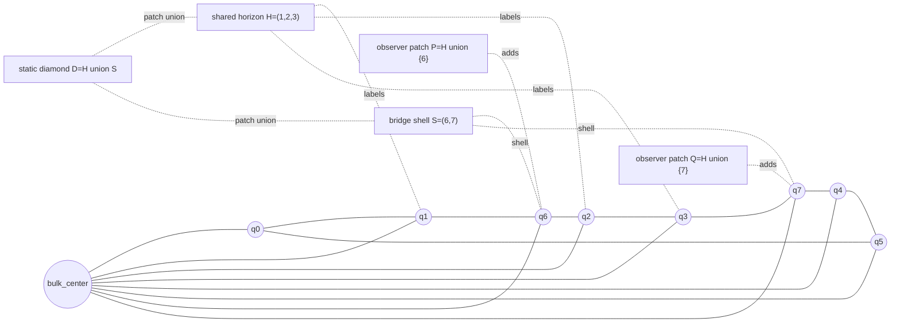

# Two-Page Human Memo: Bridge Causal Patch And Tensor-Network Seed

This memo summarizes the finite bridge causal-patch toy model through the Goal 3
Phase 1 tensor-network seed. The point is deliberately modest: build small,
exactly checkable systems where entropy, causal-patch labels, reconstruction,
erasure semantics, and a simple holographic-looking graph diagnostic can be
computed side by side.

The recurring lesson is that entanglement data can agree while operator
semantics disagree. The balanced-bridge CSS pair has the same low-order and
named patch entropy diagnostics, but observer-patch reconstruction differs. The
Goal 3 seed places the `m=1` pair on an eight-boundary-qubit ring with one bulk
center and exact min-cut enumeration. That wrapper preserves the same
separation: the two realizations share the same graph min-cut profile and
selected entropy profile, while observer algebra and a low-order erasure
witness still split.

## Bridge Causal-Patch Diagram

## Phases And Claims

| Phase | Evidence Type | Core Claim | Verification Command |
| --- | --- | --- | --- |
| Goal 1 balanced bridge | Exact theorem certificate | For the CSS family `A_m,B_m`, `n=6+2m,k=1,d=2`; labeled one- and two-qubit entropy diagnostics match, but reconstruction/algebra profiles differ. | `python3 -m qgtoy bridge-family --steps 3` |
| Goal 2 static atlas | Exact finite certificate | Named observer, shared-horizon, bridge-shell, and static-diamond entropy/overlap/MI/CMI/I3 data match, shared-horizon algebra matches, and observer-patch reconstructability differs. | `python3 -m qgtoy cosmology-phase1` |
| Goal 2 dynamics | Exact finite certificate | Deterministic bridge growth preserves the causal-patch separation and obeys exact increment laws for observer entropy, observer-pair MI, private CMI, I3, and witness algebra signatures. | `python3 -m qgtoy cosmology-phase2` |
| Goal 2 source/cover robustness | Bounded exact search | Generic covers recover the seed but not lifted bridge slices; source-aware bridge atlases recover the lifted family, showing that patch semantics are source-aware. | `python3 -m qgtoy cosmology-phase6` |
| Goal 2 repaired non-CSS | Bounded exact certificates | Distance repair, low-order entropy matching, and strict causal-patch erasure semantics are separable constraints; atlas-aware covers can recover strict hits. | `python3 -m qgtoy cosmology-phase12` |
| Goal 2 channel/co-design | Exact finite channel graphs | Stationary weights, absorbing classes, and target signs depend on transition rules and substrates; selected horizon fixed-point semantics remain stable within chosen flows. | `python3 -m qgtoy cosmology-phase27` |
| Goal 2 strict-cover audit | Exhaustive bounded search | In the 175-cover repaired family there are 66 raw hits, 8 strict hits, and 58 erasure-gate rejections; `entropy_break - full_semantics` stays negative for every strict cover. | `python3 -m qgtoy cosmology-phase31` |
| Goal 3 Phase 1 tensor-network seed | Exact finite certificate | The `m=1` bridge pair shares a ring-spoke min-cut profile and matching named/ring-interval entropy profiles, while observer reconstruction and one low-order erasure witness still differ. | `python3 -m qgtoy holography-phase1` |

## What This Teaches ER=EPR / QEC Cosmology

The toy model gives a concrete pressure test for the slogan that entanglement
is geometry. In these finite stabilizer examples, the same entanglement
diagnostics do not force the same observer-accessible operator geometry. The
observer patches can have identical named entropies and still disagree about
whether the full logical algebra is reconstructable. That is exactly the kind
of small counterexample one wants before making broad claims about ER=EPR-style
connectivity.

The QEC lesson is sharper: geometry-like structure is not just a scalar entropy
profile. It also depends on which regions reconstruct logical operators, which
erasures are correctable, what the center of the observer algebra is, and what
fixed points survive after a patch is removed. The bridge pair isolates these
diagnostics cleanly. Shared-horizon algebra can agree while observer algebras
split; low-order entropy can agree while erasure semantics split.

The cosmology-as-code lesson is methodological. The role labels, patch covers,
growth rules, and channel rules make a tiny universe whose claims are ordinary
data structures and exact computations. That makes the project useful as an AI
search target: neural or heuristic search can propose states, covers, and flows,
but every accepted result must reduce to exact stabilizer algebra, finite graph
enumeration, rational transition rules, or bounded exhaustive search.

Goal 3 adds a first holographic-code-style wrapper without pretending the toy
has become a continuum spacetime. The ring-spoke skeleton contributes a shared
min-cut-visible geometry. The stabilizer codes contribute entropy-visible and
operator-visible geometry. The fact that these layers can agree in some
diagnostics and split in others is the main scientific value.

## Why This Is Not Overclaimed

Nothing here solves quantum gravity, proves ER=EPR, or establishes a physical
AdS/CFT model. The codes are tiny, mostly `k=1`, and many witnesses have
distance `d=2`, so they are diagnostic rather than fault-tolerant. The patch
labels are not physical geometry by themselves; they are a finite grammar for
asking reproducible questions about regions.

The Goal 3 min-cut graph is also intentionally conservative. Its min-cut values
are reported as exact graph diagnostics beside exact stabilizer entropies. They
are not asserted to equal entropies globally, and the certificate does not claim
an RT theorem. This is important: the graph is a wrapper that tests whether a
shared geometric skeleton can coexist with different reconstruction semantics.

The bounded searches are exhaustive only within their stated grammars. Phase 31
really exhausts the 175-cover repaired family, but it does not exhaust all
possible covers, all stabilizer codes, or all tensor networks. Channel results
are exact for the specified transition graphs and rational rules, not universal
laws of cosmological dynamics.

So the package is best read as a compact theorem-and-certificate bundle: it
shows that several folk identifications between entropy, connectivity, horizon
semantics, and observer reconstruction fail in small exact systems. That is a
useful toy-universe result, and a good launchpad for the next bounded search:
less hand-seeded graph-state, CSS tensor-network, or Clifford-MERA-like code
families with the same certificate discipline.
