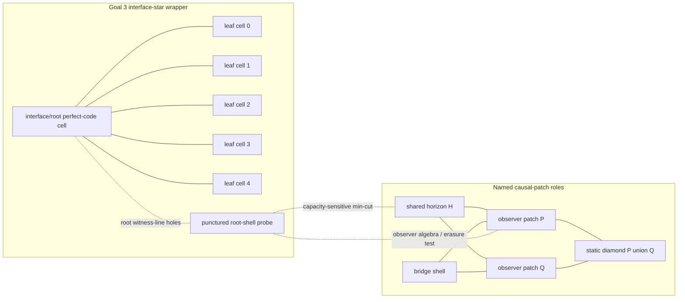

# Two-Page Human Memo: Bridge Causal Patches Through Phase 25

## One-Sentence Result

The finite bridge toy models now have a sharper holographic-code frontier:
even after wrapping the source in perfect-code cells, adding an explicit
interface/root cell, puncturing the bridge shell, and applying four bounded
two-layer Clifford/MERA-like outer circuits, the exact admissible set remains
empty for regions that simultaneously match entropy, show capacity-sensitive
min-cut geometry, and split observer operator/channel semantics.

## Bridge Causal-Patch Diagram

The diagram is combinatorial. The nodes are named qubit regions and finite
graph skeletons, not continuum spacetime. The point is to make the same
region pass through exact entropy, min-cut, algebra, erasure, and channel
diagnostics before calling it a causal-patch witness.

## Phase / Claim Table

| Phase or package | Main claim | Status |
| --- | --- | --- |
| Goal 1 balanced bridge | The CSS family `A_m,B_m` has `n=6+2m,k=1,d=2`, matching labeled one- and two-qubit entropies, no single-qubit non-central logical reconstruction, and distinct observer algebra profiles. | Theorem-level generator rule plus exact finite-prefix checks |
| Goal 2 causal-patch atlas | Named patch entropy, MI/CMI/I3, and shared-horizon algebra match while observer-patch reconstructability differs; deterministic bridge growth preserves the separation. | Exact finite certificates |
| Goal 2 strict-cover/channel package | Source-aware covers recover lifted bridge semantics; repaired non-CSS examples separate entropy matching, distance repair, and strict erasure gates; Phase 31 exhausts 175 covers with 8 strict hits and no strict `entropy_break - full_semantics` flip. | Exact bounded searches and exact finite channel certificates |
| Goal 3 Phases 1-4 | Ring-spoke and graph/CWS sources lift the bridge split into tensor-network-style atlases; compact locality depends on source-aware covers. | Exact finite certificates and bounded searches |
| Goal 3 Phases 5-13 | Generated layouts, Clifford layers, compact-patch searches, and perfect outer blocks show that entropy/min-cut-visible structure can match while operator algebra and erasure semantics split. | Exact bounded circuit/layout audits and exact finite certificates |
| Goal 3 Phases 14-21 | Larger perfect-cell chains, rings, capacity variants, local repairs, and topology changes keep producing no-go frontiers where min-cut variation and operator/channel split do not land on the same certified regions. | Exact finite certificates and exhaustive bounded menus |
| Goal 3 Phase 22 | A five-cell branching outer code gives `n=125,k=1`, matches `7876` low-order entropy checks, but all 99 entropy-variable core-shell survivors have no operator/channel hit. | Exact finite certificate |
| Goal 3 Phase 23 | A six-cell interface-star outer code gives `n=150,k=1`, matches `11326` low-order entropy checks, and separates compact operator hits from capacity-sensitive interface-shell regions. | Exact finite certificate |
| Goal 3 Phase 24 | The 25 one-qubit punctured root-shell probes all match entropy and all have capacity-sensitive min-cuts, but none has an operator/channel split. | Exact finite frontier |
| Goal 3 Phase 25 | Four two-layer Clifford/CX menus replay the 25 punctures, for 100 exact records: 20 entropy matches, 100 min-cut-variable records, 30 operator/channel near-hits, and 0 admissible entropy-matched operator hits. | Exact finite frontier plus regression test |

## What This Teaches ER=EPR/QEC Cosmology

The useful lesson is not that ER=EPR is false. It is more precise: finite QEC
systems can make entanglement-looking data, geometry-looking min-cut data, and
observer reconstruction data come apart. The balanced bridge seed already
showed that matching low-order entropy and shared-horizon diagnostics do not
force matching observer algebra. Goal 3 asks whether that separation survives
more holographic-looking wrappers. Through Phase 25, it does.

Phase 23 and Phase 24 are the cleanest causal-patch pressure tests. The
interface-star model has a root cell, five leaf cells, exact capacity profiles,
and named shell probes. Puncturing the root witness line makes every tested
region capacity-sensitive and entropy-matched, but the operator/channel
semantics still agree across the two codes. In other words, the shell looks
more geometric under min-cut diagnostics without becoming a reconstruction
witness.

Phase 25 is especially informative because it tries to repair that failure by
mixing supports with bounded two-layer Clifford circuits. The circuits do
create 30 operator/channel-visible near-hits, but every one of those breaks
the entropy match. The admissible triple intersection remains empty:
`entropy match + min-cut variation + operator/channel split = 0`.

That is a useful AI-search target. A neural or heuristic generator can propose
states, code pairs, circuits, boundary orders, covers, and channel rules. The
project then accepts only claims that survive exact stabilizer rank
computation, exact region algebra, exact erasure checks, exact finite min-cut
enumeration, and bounded exhaustive search where claimed. This makes the toy
cosmology small enough to falsify and rich enough to teach.

## Why This Is Not Overclaimed

Nothing here is a continuum wormhole, a physical de Sitter dual, or a solution
to quantum gravity. The causal patches are finite qubit subsets with role
labels. The labels matter because they define reproducible diagnostics, but
they are not physical geometry by themselves.

The exactness is local to declared families. Goal 1 is theorem-level for one
balanced-bridge CSS generator rule. Goal 2 Phase 31 is exhaustive for one
175-cover repaired family. Goal 3 Phase 25 is exact for four hand-built
two-layer CX menus and 25 punctured interface-shell regions. It does not
enumerate all Clifford circuits, all MERA layouts, all tensor networks, all
covers, all holographic codes, or all possible boundary regions.

The strongest honest claim is therefore methodological and diagnostic:
entropy-visible, min-cut-visible, reconstruction-visible, and channel-visible
semantics are separable in small certified QEC universes. The next serious
moves are to search larger circuit neighborhoods around the Phase 25 near-hits,
look for `d >= 3` analogues with stronger matching constraints, or translate
the finite result package into a short paper-style note.

